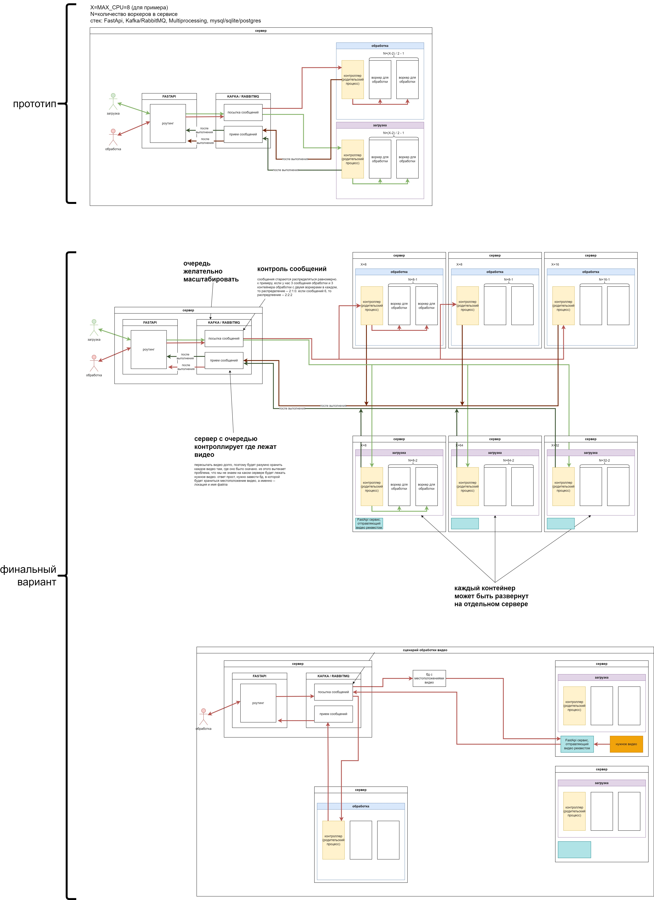

## данный проект -- макет архитектуры отказоустойчивого масштабируемого сервиса на питоне для параллельной обработки и скачивания видео

## задача

реализовать мини-сервис, предоставляющий возможность загрузить и обработать видео из разных источников. Под источниками понимается: локальный файл, youtube-видео или torrent-файл. Под обработкой понимается вызов внешней утилиты, например, вызов команды “ffmpeg -y -i {video-file} -f null -”.

Ключевой особенностью мини-сервиса является возможность обеспечить распределенную работу подсистем сервиса и взаимодействие между ними.

